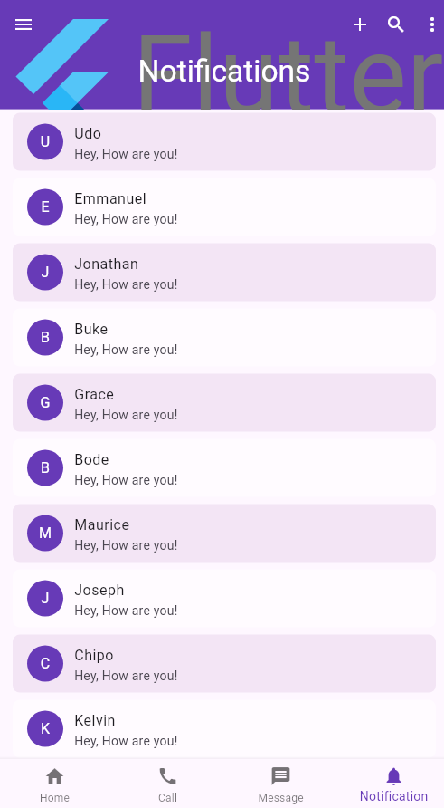

# SliverAppBar Demo

A Flutter demo on `SliverAppBar` showing how an app bar can collapse, float,and snap to give user a wanderful UI experience.

---

## Run Instructions

```bash
flutter pub get
flutter run
```

---

## The Three Key Attributes

| Attribute | What it does |
|-----------|-------------|
| `pinned: true` | The bar shrinks but stays at the top always visible |
| `floating: true` | The bar hides completely when scrolling down and reappears the moment you scroll up |
| `snap: true` | Must be paired with `floating`. On scroll down it hides but snaps back into view with a quick animation if the user scroll up slightly and stops

---

## Screenshots

> Screenshot of the Notifications screen demonstrating a real-world `SliverAppBar` with `floating` and `snap` enabled. The bar hides as the user scrolls down and snaps fully back into view on scroll up.

---

## widget Description

`SliverAppBar`: This widget is a specialized, scroll-aware app bar that expands, contracts, floats, or hides as the user scrolls through a page. It lives inside a `CustomScrollView` because it is a sliver.

---

Built by **Janviere Munezero**
